<style>

.bottom {
  margin: 0;
  position: absolute;
  top: 80%;
  left: 50%;
  -ms-transform: translate(-50%, -50%);
  transform: translate(-50%, -50%);
}

@media print {
  .has-continuation {
    display: block !important;
  }
}

.large { font-size: 130% }

.small {font-size: 80% }

remark.macros.scale = function (percentage) {
  var url = this;
  return '';
};


.scrollable-slide {
    height: 800px;
    overflow-y: auto !important;
    
}


</style>

```{r setup, include=FALSE}
options(htmltools.dir.version = FALSE)
knitr::opts_chunk$set(cache = TRUE, fig.align = "center", dev = "svg", message = FALSE, warning = FALSE)
options(tibble.print_max = 6, tibble.print_min = 6)
knitr::opts_knit$set(root.dir = normalizePath('../'))


hook_source <- knitr::knit_hooks$get('source')
knitr::knit_hooks$set(source = function(x, options) {
  x <- stringr::str_replace(x, "^[[:blank:]]?([^*].+?)[[:blank:]]*#<<[[:blank:]]*$", "*\\1")
  hook_source(x, options)
}) #To highlight code more easily (see https://www.garrickadenbuie.com/blog/highlight-lines-without-breaking-the-code-in-xaringan/)


```

```{r, echo = FALSE, warning=FALSE, message=FALSE}
library(tidyr)
library(dplyr)
library(tibble)

```

```{css, echo=FALSE}
pre {
  max-width: 100%;
  overflow-x: scroll;
}
```


# Who is talking ? 

<!-- .pull-left[] -->
.center[
]

<!-- -- -->
<!-- .pull-right[] -->


.center[]

---
class: center, middle

# What you have to do:

.large[Open Rstudio]

<!-- -- -->

<!-- .large[Open the website: ] -->

--

.large[Stop me if anything is unclear]


---

# What we will talk about today

--

* Visualize data in R

--

* Customize your plots

--

* Avoid caveats in data visualization


--

# What we will NOT talk about today

--

* Manipulate data etc. (next week :-) )


---


class: inverse, middle, center

## Data-visualisation: WHY ?


---

### What have these sets of points in common ?

.center[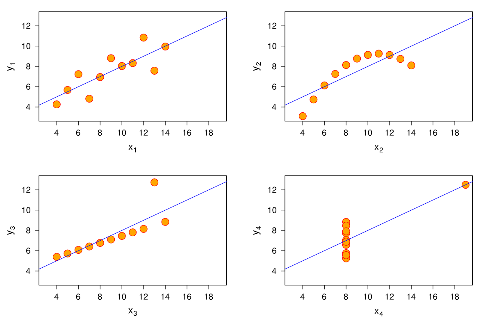]


---

.center[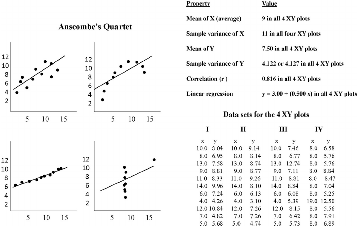]


---


class: inverse, middle, center

## DATA-VISUALIZATION IS AN ESSENTIAL STEP

--

## OUR BRAINS ARE NOT MADE TO SEE PATTERNS IN TABLES


---


## Framework

All manipulations will be done in the `tidyverse` framework.


--

Hence, you should, if not already done, run the following command in R __NOW__

```{r, echo = TRUE, eval=FALSE}

install.packages("tidyverse")
```


---

# Tidyverse = Tidy universe

Tidyverse is a set of packages with differents purposes, that share the same syntax and that are designed to work in a complementary way  

--

.center[]


---

.center[Today, we'll focus on the package ggplot2.]

--

.center[]

--
.center[]

<!-- You can list the packages available in the `tidyverse` by running the following command: -->

```{r, echo = FALSE, eval = FALSE}
# tidyverse::tidyverse_packages()

```

<!-- -- -->

<!-- You can see that `ggplot2` that you may already know belongs to the `tidyverse`. But there are *many other packages* !  -->

<!-- -- -->

<!-- For instance, the `forcats` package allows to work in a convenient way with factors, `lubridate` with dates etc. . -->

<!-- -- -->

<!-- For now, we will take a closer look to the `readr` and to a lesser extent `readxl` packages. These packages are useful to __import__ data. -->


---


class: inverse, middle, center

## ggplot2, WHY ?


---

.center[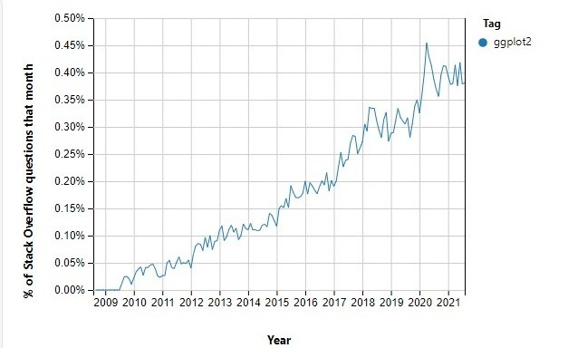]

<!-- .center[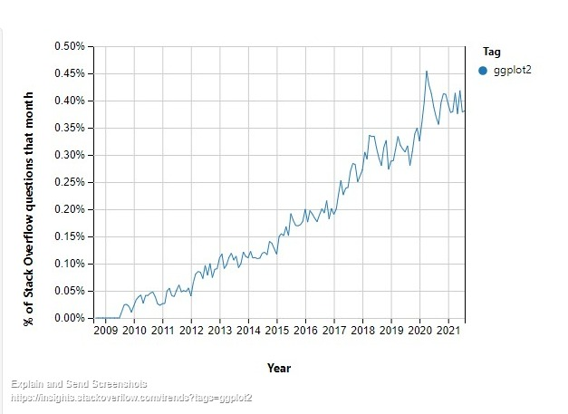] -->

---


# Base R plots vs ggplot2: the clash

__Base graphics:__

  * directly available from R
  * easy to use for beginners
  * is less verbose for simple / canned graphics
  * has methods (plot works for many different ojects)

__ggplot2:__

  * R graphing package by Hadley Wickham based on the Grammar of Graphics (Wilkinson, 2005)
  * is less verbose for complex / custom graphics: plots can be iteratively built up and edited later
  * carefully chosen defaults = publication-quality graphics in seconds


---

# Harder ? Not really

.center[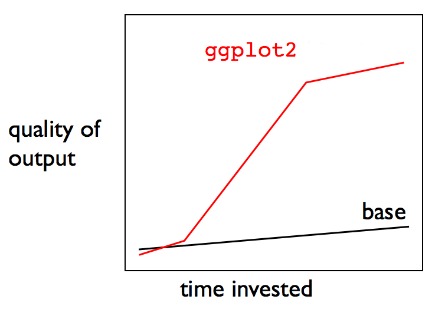]

---

class: inverse, middle, center

## GGPLOT2: BASICS


.center[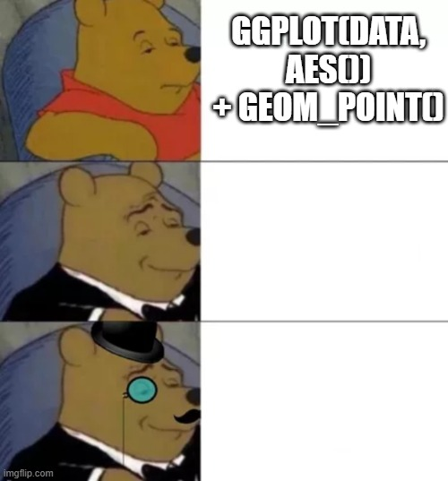]

---
<h3>ggplot2 building blocks</h3>
<div class="slideContent">
<ul>
<li><p><strong>Data</strong>: a <code>data.frame</code> and nothing else!</p></li>
<li><p><strong>Aesthetic mapping</strong>: describe how data are mapped to things we can see on the plot through the function <code>aes()</code>.</p></li>
<li><p><strong>Geometric object</strong>: perform the actual rendering of the plot and control the type of plot to create (<code>points</code>, <code>line</code>, <code>histogram</code>, <code>boxplot</code>…).</p></li>
<li><p><strong>Statistical transformations</strong>: transform the data for instance by summarising it in some manner (<code>sum</code>, <code>density</code>, <code>smooth</code>…)</p></li>
<li><p><strong>Position adjustments</strong>: apply minor changes to the position of elements (<code>jitter</code>, <code>fill</code>, <code>stack</code>, <code>dodge</code>, <code>identity</code>)</p></li>
</ul>

<!-- - Scales -->

<!-- - Coordinate system -->

<!-- - Faceting -->

<!-- voir livre page 37 pour une reformulation ?vnentuelle -->

</div>

</section>

---

## In a nutshell


.center[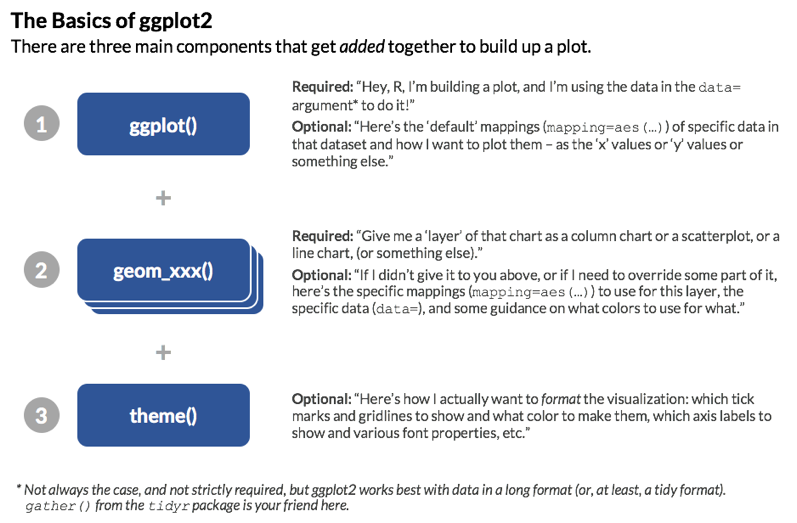]


---

# Syntax


```{r ggplot2 structure, eval=  FALSE}

library(ggplot2)
ggplot(data = <DATA>,
       aes(x = <X AXIS VARIABLE>,
           y = <Y AXIS VARIABLE>, ... ), ...) +

  geom_<TYPE>(aes(size = <SIZE VARIABLE>, ...),
                   data = <DATA>,
                   stat = <FUNCTION>,
                   position = <POSITION>,
                   color = <"COLOR">, ...) +

  scale_<AESTHETIC>_<TYPE>(name = <NAME>,
                   breaks = <WHERE>,
                   labels = <LABELS>, ... ) +

  theme(...) +
  facet_<TYPE>(<FORMULA>)


```


---


### What happens when we create a simple ggplot() object ?

```{r,  fig.height=3}
library(ggplot2)
ggplot()

```


### Almost nothing


---


### Specify data


```{r}
data("mpg")
head(mpg)
# See ?economics for the description of the dataset

```

---
```{r, fig.height = 3}
p <- ggplot(data = mpg, aes(x =displ,  y= hwy ))
p
```

--

### Almost nothing ? Look at the axes :-)


---

### Let's specify what sort of plot we want, using a `geom_*` functions


```{r, fig.height=3}
p <- ggplot(data = mpg, aes(x =displ,  y= hwy ))
p + geom_point()
```

---

### Another `geom_*`


```{r, fig.height=3, message = FALSE}
p <- ggplot(data = mpg, aes(x =displ,  y= hwy ))
p + geom_smooth()
```


---

### Combine two `geom` ?

Simply __add__ as many geom_functions as you want


```{r, fig.height=3, message = FALSE}
p <- ggplot(data = mpg, aes(x =displ,  y= hwy ))
p + 
  geom_smooth() + 
  geom_point()
```

---

### Combine three `geom` ?

* Suppose we want to also look a linear thrend

* Need for help

```{r}
?geom_smooth
```
---

.center[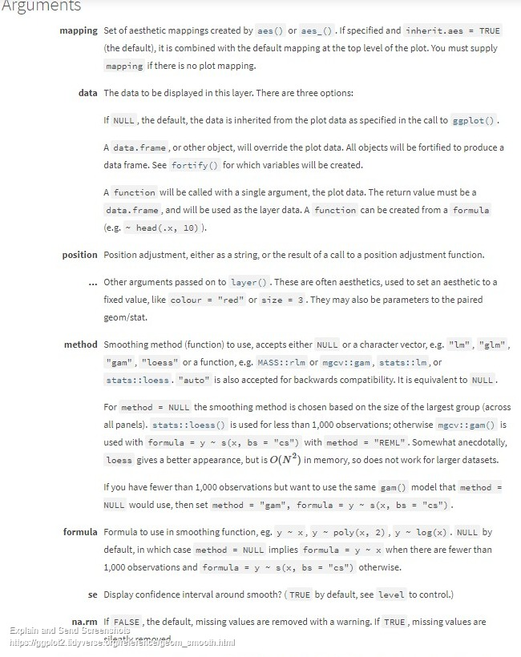]


---


```{r, fig.height=3, message = FALSE}
p <- ggplot(data = mpg, aes(x =displ,  y= hwy ))
p + 
  geom_smooth() + 
  geom_point() + 
  geom_smooth(method = "lm", se = FALSE)
```


---

### There are *many* `geom_*` functions:

```{r}
ls("package:ggplot2")[grepl(ls("package:ggplot2"),pattern =  "geom")]
```

---

### Quick look around of some classical  `geom_*` functions: `geom_histogram`


```{r, fig.height=3}
ggplot(data = mpg, aes(x = displ)) +
  geom_histogram()

```

---

### Quick look around of some classical  `geom_*` functions: `geom_density`


```{r, fig.height=3}
ggplot(data = mpg, aes(x = displ)) +
  geom_density(fill = "blue", alpha = .3) # alpha: transparency

```


---

### Quick look around of some classical  `geom_*` functions: `geom_boxplot`


```{r, fig.height=3}
ggplot(data = mpg, aes(x = manufacturer, y = cty)) +
  geom_boxplot()
```

---

### Quick look around of some classical  `geom_*` functions: `geom_bar`


```{r, fig.height=3}
ggplot(data = mpg, aes(x = manufacturer)) +
  geom_bar(alpha = .3, col = "purple", fill = "red") # col = borders ; fill = colour inside
```

---
### Take a look at this site to choose a plot
[https://www.data-to-viz.com/](https://www.data-to-viz.com/)


.center[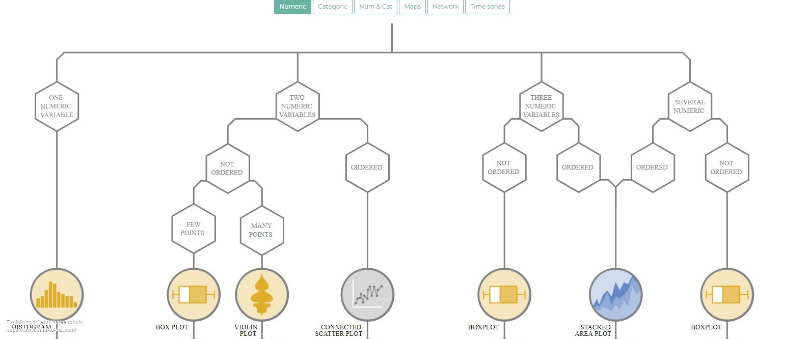]


---

class: center, middle

# .large[Is everything clear ?]


<!-- --- -->


<!--  -->

<!-- -- -->

<!-- .large[~ 15 minutes] -->


---

# Exercises


.large[~ 20 minutes]

--
  
.large[*Open "ggplot2_basics" with Rstudio*]


---

class: inverse, middle, center

## GGPLOT2: Aesthetics / Facets / Labs


.center[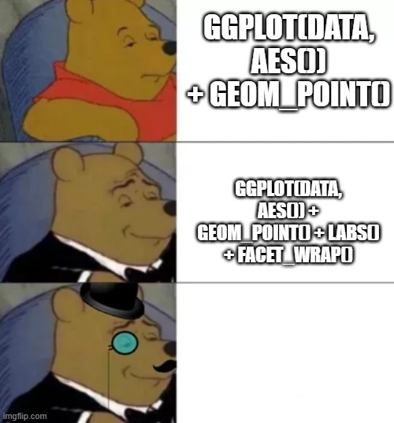]


---

* One may want to :

--

### add color/transparency to the points

--

### do one plot for each manufacturer (or modality of a given factor)

--

### specify a title/subtitle to the plot


---

## Aesthetics, basics

<section data-transition="linear" data-transition-speed="default" class="present" style="display: block;">
<h3>Aesthetic mapping vs. parameter setting</h3>
<div class="slideContent small-code">
<p>Aesthetic mapping:</p>

<ul>
<li>Data value determines visual characteristic</li>
<li>use <code>aes()</code></li>
</ul>

<pre><code class="r"><span class="identifier">ggplot</span><span class="paren">(</span><span class="identifier">diamonds</span>, <span class="identifier">aes</span><span class="paren">(</span><span class="identifier">x</span> <span class="operator">=</span> <span class="identifier">carat</span>, <span class="identifier">y</span> <span class="operator">=</span> <span class="identifier">price</span>, <span class="identifier">color</span> <span class="operator">=</span> <span class="identifier">clarity</span><span class="paren">)</span><span class="paren">)</span> <span class="operator">+</span> <span class="identifier">geom_point</span><span class="paren">(</span><span class="paren">)</span>
</code></pre>

<p>Setting:</p>

<ul>
<li>Constant value determines visual characteristic</li>
<li>Use parameter in <code>geom_&lt;TYPE&gt;</code></li>
</ul>

<p></p><center><p></p>

<pre><code class="r"><span class="identifier">ggplot</span><span class="paren">(</span><span class="identifier">diamonds</span>, <span class="identifier">aes</span><span class="paren">(</span><span class="identifier">x</span> <span class="operator">=</span> <span class="identifier">carat</span>, <span class="identifier">y</span> <span class="operator">=</span> <span class="identifier">price</span><span class="paren">)</span><span class="paren">)</span> <span class="operator">+</span> <span class="identifier">geom_point</span><span class="paren">(</span><span class="identifier">color</span> <span class="operator">=</span> <span class="string">"red"</span><span class="paren">)</span>
</code></pre>

</div>

</section>


---

* Let's take another dataset

```{r}

data(diamonds)
data_work <- diamonds[sample(1:nrow(diamonds), 5000),] # take 10000 random values of diamonds
head(data_work)

# See ?diamonds for the description of the dataset
```

---

```{r}
str(data_work)
```

---


* Price vs carat ?


--

```{r, fig.height = 4}
p_diamonds <- ggplot(data_work, aes(x = carat, y = price)) + 
  geom_point()
p_diamonds
```


---

* We want the points to be green

--

* This does not depend on the data $\rightarrow$ We specify the color argument *outside* `aes`

--

```{r, fig.height = 3}
p_diamonds <- ggplot(data_work, aes(x = carat, y = price)) + 
  geom_point(col = "green")
p_diamonds
```


---

* One shape for each for each number of cylinders of the cars


--

* This *depends*  on the data $\rightarrow$ We specify the color argument *inside* `aes`

--

```{r, fig.height = 2, eval = FALSE}
p_diamonds <- ggplot(data_work, aes(x = carat, y = price)) + 
  geom_point(aes(`col = cut`)) `#Says to ggplot2, give on color to each modality of cut`
p_diamonds
```


```{r, fig.height = 3.5, echo = FALSE, warning=FALSE}
p_diamonds <- ggplot(data_work, aes(x = carat, y = price)) + 
  geom_point(aes(col = cut)) #Says to ggplot2, give on color to each modality of cut
p_diamonds
```


---

* One color for each for each color of the diamond, one shape for each cut of the diamond

--

* This *depends*  on the data $\rightarrow$ We specify the color and shape arguments *inside* `aes`

--

```{r, fig.height = 2, eval = FALSE}
p_diamonds <- ggplot(data_work, aes(x = carat, y = price)) + 
  geom_point(aes(`col = color, shape = cut`)) `#Says to ggplot2, give on shape to each modality of cut, one color to each diamond color`
p_diamonds
```


```{r, fig.height = 3.5, echo = FALSE, warning=FALSE}
p_diamonds <- ggplot(data_work, aes(x = carat, y = price)) + 
  geom_point(aes(col = color, shape = cut)) #Says to ggplot2, give on color to each modality of cut
p_diamonds
```

---

* If the variable mapped to color is continuous, then the scale of the colour becomes automatically continuous

--

```{r, fig.height = 3, echo = TRUE}
p_diamonds <- ggplot(data_work, aes(x = carat, y = price)) + 
  geom_point(aes(col = depth),
             alpha = .1) #Says to ggplot2, give on color based on the value of depth
#Put transparency on 0.1, regardless of the points' values
p_diamonds
```

---

### Working with aesthetics: scale

```{r, fig.height =4}
p_diamonds + scale_color_continuous(low = "blue", high = "red")
```


---

### Working with aesthetics: modify the shape's legend

```{r, fig.height = 3, eval = FALSE}
p <- ggplot(data = mpg, aes(x =displ,  y= hwy ))+ 
  geom_point(aes(shape = factor(cyl)),
             alpha = .3) +
  scale_shape_discrete(`labels = paste(c(4,5,6,8), "cylinders")`)  `# Modify labels of the legend`
p 
```

```{r, fig.height = 3, echo = FALSE}
p <- ggplot(data = mpg, aes(x =displ,  y= hwy ))+ geom_point(aes(shape = factor(cyl)), alpha = .3) +
  scale_shape_discrete(labels = paste(c(4,5,6,8), "cylinders"))
p 
```

---

## Facet: draw multiple plots easily


* Distribution of prices for the whole dataset:


--

```{r, fig.height = 2}
histogram_prices <- ggplot(data_work, aes(x = price)) + # No need for a y as we only need an histogram
  geom_histogram()
histogram_prices
```

--

* What if we want the distributions of prices *for each* modality of the *cut* variable


---

We simply need to use the `facet_wrap` function:

```{r, fig.height = 4}

histogram_prices + 
  facet_wrap(cut~. )
```

---

We can use the `scales` argument, to let scales vary freely across plots

```{r, fig.height = 4}

histogram_prices + 
  facet_wrap(cut~., scales = "free_y" )
```


---

* We can also make a grid of plots, using `facet_grid` function


```{r, fig.height = 4}

histogram_prices + 
  facet_grid(cut~color,scales = "free_y")
```

---

## Titles and subtitles: say what you show, and show what you say


* Many ways exist to specify titles in ggplot

--

* The easiest one may be to use the `labs` function

--


* Let's take another dataset

```{r}

data(economics)
head(economics)
str(economics)
# See ?economics for the description of the dataset
```

---

```{r, fig.height = 3}
plot_unemployed <- ggplot(data = economics, aes(x  =date, y = unemploy)) + 
  geom_line() + 
  geom_smooth(se = FALSE) + 
  geom_smooth(span = 0.05, col = "green", se = FALSE ) 

plot_unemployed
```

---

* Adding a title is straightforward

--
```{r, fig.height = 3}
plot_unemployed + 
  labs(title = "Number of unemployed people (in thousands) in the USA")

```


---

* Adding subtitle/caption is also straightforward

--

```{r, fig.height = 3}
plot_unemployed + 
  labs(title = "Number of unemployed people (in thousands) in the USA", 
       subtitle = "From 1967 to 2015", 
       caption = "Copyright Remi Mahmoud :-)")

```
---

* Adding modifying axes titles is also straightforward

--

```{r, fig.height = 3}
plot_unemployed + 
  labs(title = "Number of unemployed people (in thousands) in the USA",
       subtitle = "From 1967 to 2015",
       caption = "Copyright Remi Mahmoud :-)", x = "DATE", y = "Number of unemployed people")

```


---


* Title of a legend can also be changed using the `labs` function

```{r, eval= FALSE}
p_diamonds+ `labs(colour = "Depth\nof the\ndiamond")`
```


```{r, fig.height = 4,echo = FALSE}
p_diamonds + labs(colour = "Depth\nof the\ndiamond")
```

---


# Exercises


.large[~ 20 minutes]

--
  
.large[*Open "ggplot2_basics" with Rstudio*]


---


class: inverse, middle, center

## GGPLOT2: Customizing your plot

.center[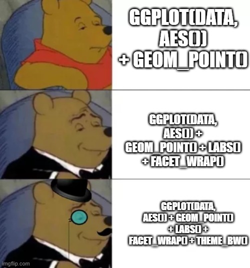]


---

* One may want to :

--

### specify color / shapes of points / boxplots / bars

--

### change the sizes/font/orientation of labels / titles

--

### change the background


---

### Themes: global appearance of the plot

* You may have notice the (horrible) grey background of the default plots

--
```{r, echo = TRUE, fig.height=3}

plot_population <- ggplot(data = economics, aes(x  =date, y = pop)) + 
  geom_line() +
  labs(y = "Population")

plot_population

```

---

Non-data elements, like background property, legend appearance, axis labels are handled by *themes* in `ggplot`.

--

We will se how to specify our own themes, but there are already some predefined themes (`theme_bw()`, `theme_minimal`) .

--

To modify the theme of a plot, simply add it to the ggplot object

---

```{r, fig.height = 4}

plot_population + theme_minimal()
```

---


```{r, fig.height = 4}
plot_population + theme_bw()
```
---

```{r, fig.height = 4}
plot_population + theme_dark()
```
---

.small[

* Look at the (long) list of things you can modify in a theme

```{r, fig.height = 4}
(attributes_theme <- names(theme_bw()))
```


]


---

* Some of the attributes of a `theme` regard text's elements (titles, axis labels etc.)
```{r}
attributes_theme[grepl(attributes_theme, pattern = "text|title")]
```
--
* Texts elements are modified using the `element_text()` function

--

* `element_text()` can set the font, the color, the angle of the text setted (see `?element_text()` for a complete list)

---
### Modify texts elements

```{r, eval = FALSE}
p_diamonds +
  theme_bw() +
  labs(title = "A nice title") +
  theme(axis.title.x = element_text(color = "red"), `# Modify title of the x axis`
          axis.title.y = element_text(color = "orange"), `# Modify title of the y axis`
        axis.text = element_text(angle = 180), # Modify the angle of `all` the axis texts
        legend.title = element_text(size = 14 ),`# Modify the size of the legend title`
        plot.title = element_text(face = "bold"), `# Modify the face of the plot title`
        title = element_text(face = "italic")) # Modify the face of `ALL` titles
```

```{r, echo = FALSE, fig.height=2}
p_diamonds +
  theme_bw() +
  labs(title = "A nice title") +
  theme(axis.title.x = element_text(color = "red"), # Modify title of the x axis
          axis.title.y = element_text(color = "orange"), # Modify title of the y axis
        axis.text = element_text(angle = 180), # Modify the angle of all the axis texts
        legend.title = element_text(size = 14 ),# Modify the size of the legend title
        plot.title = element_text(face = "bold"),
        title = element_text(face = "italic")) 
```

---

### Modify background of  elements

* Background elements are modified using the `element_rect()` function

```{r}
attributes_theme[grepl(attributes_theme, pattern = "background")]
```
---


```{r, eval = FALSE}
p_diamonds +
  theme_bw() +
  labs(title = "A nice title") +
  theme(legend.background = element_rect(color = "black", linetype = "dashed"), `#modify the rectangle across the legend`
        plot.background = element_rect(fill = "lightblue", colour = "purple"), `#guess what ?`
        panel.background = element_rect(fill = "pink")) `#guess what ?`
```

--


```{r, echo = FALSE, fig.height = 3}
p_diamonds +
  theme_bw() +
  labs(title = "A nice title") +
  theme(legend.background = element_rect(color = "black", linetype = "dashed"), #modify the rectangle across the legend
        plot.background = element_rect(fill = "lightblue", colour = "purple"), #modify the rectangle across the legend
        panel.background = element_rect(fill = "pink")) 
```

---

# Save your plot using `ggsave`


* Saving your plot at a fixed size is a good  practice
--

```{r, eval=FALSE}
#Many parameters exist to save your plots
ggsave(filename = "my_path/title_of_the_plot.jpg",
       plot = my_plot, units = "cm",
       height = 25, width = 20)

```


---

# Exercises


.large[~ 20 minutes]

--
  
.large[*Open "ggplot2_customization" with Rstudio*]


---

class: inverse, middle, center

## Conclusion


---

* This was just an introduction

--

* ggplot2 offer *many* possibilities

--

* Here are some wonderful plots by @abichat to give you some tastes 

---

.center[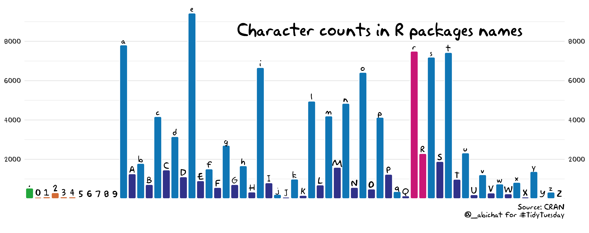
]

--

.center[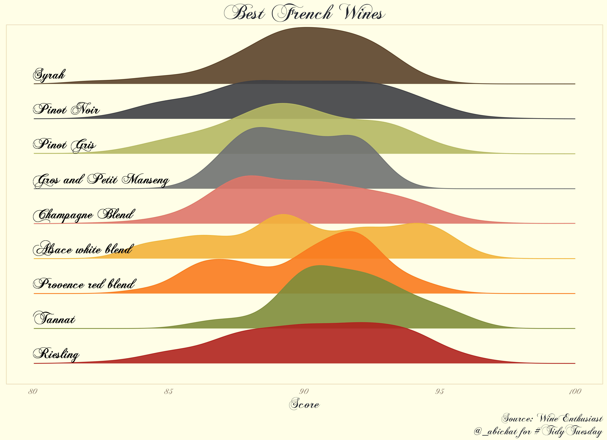
]
---

.center[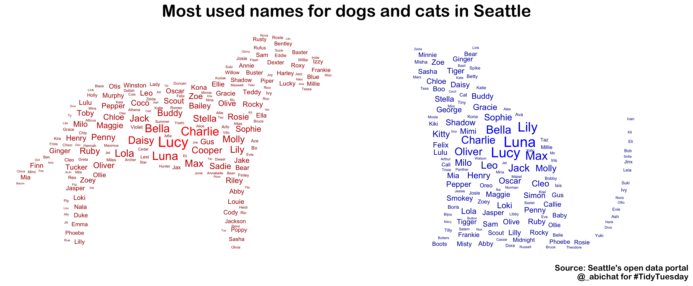
]
--

.center[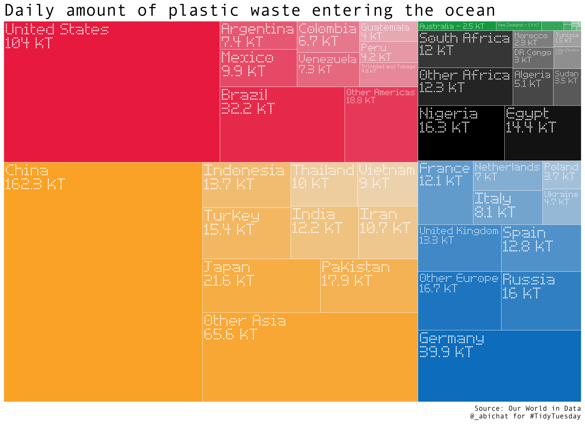
]


---

## ggplot2 resources online

* [wonderful and complete article about ggplot](https://cedricscherer.netlify.app/2019/08/05/a-ggplot2-tutorial-for-beautiful-plotting-in-r/): my holy bible for ggplot2
* [a bunch of tutorials](https://ggplot2tutor.com/) on ggplot2, really clear
* [the ggplot2 book](https://ggplot2-book.org/), recall and explanations


---

## References

* [a lesson from N. Vialaneix](http://www.nathalievialaneix.eu/doc/html/biostat-ggplot2.html#/)
* [the ggplot2 book](https://ggplot2-book.org/)
* [wonderful plots of A. Bichat](https://github.com/abichat/tidytuesday): go take a look !


---

class: center, middle

# THANKS

--

.large[Any remark, questions ?]

--

.large[remi.mahmoud@inrae.fr]

--

Lesson contents available at: [https://github.com/RemiMahmoud/ggplot2_lesson](https://github.com/RemiMahmoud/ggplot2_lesson)

